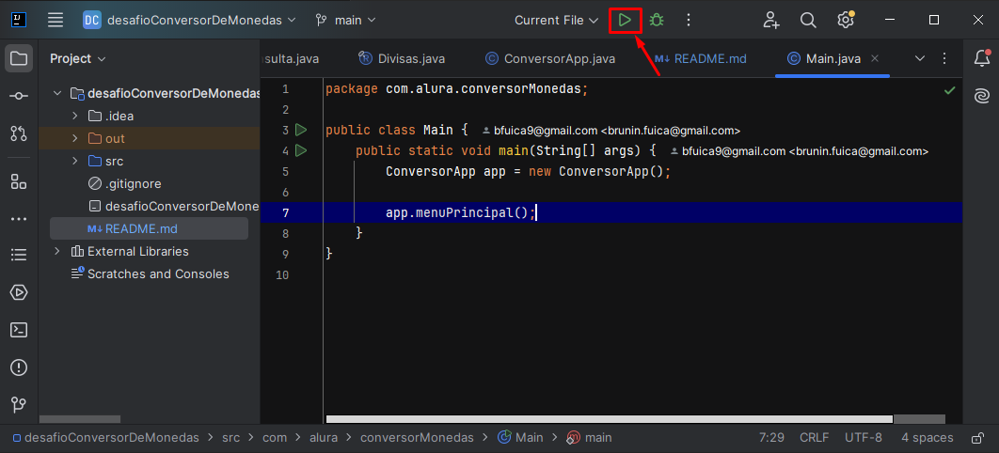
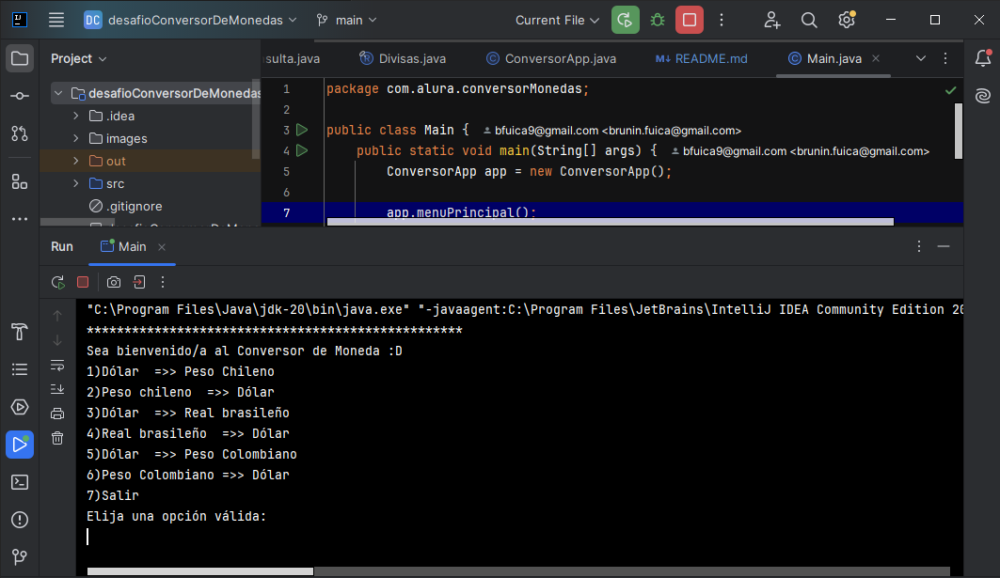
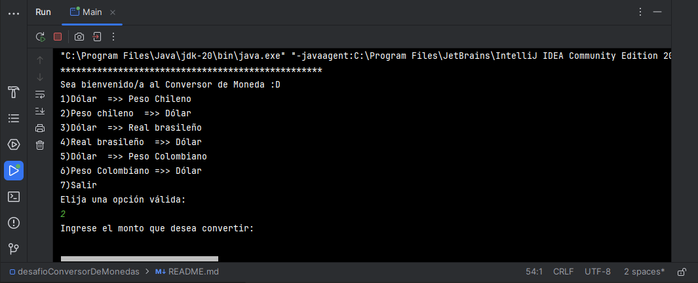
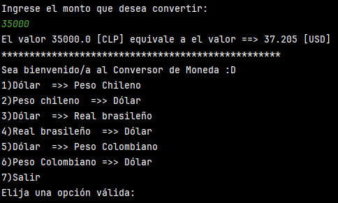
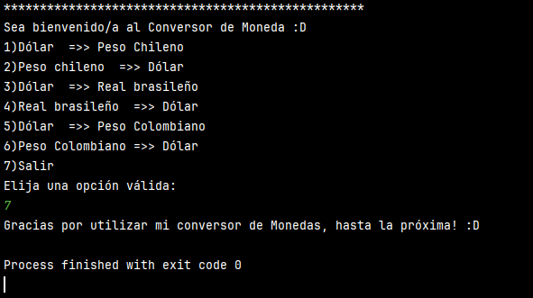

# 💱 Conversor de Monedas - Desafío Alura Latam

Este proyecto es un conversor de monedas desarrollado en Java como parte del programa de formación de Alura Latam junto con Oracle Next Education.

Permite al usuario convertir entre diferentes monedas usando datos en tiempo real obtenidos desde una API.

---

## 🚀 Tecnologías utilizadas

- 💻 Java 20
- 🧪 Biblioteca Gson (para el manejo de JSON)
- 🌐 API de [ExchangeRate-API](https://www.exchangerate-api.com/)
- 🛠️ IDE: IntelliJ IDEA

---

## ⚙️ Funcionalidades principales

- Menú interactivo por consola
- Conversión en tiempo real entre las siguientes monedas:
    - Dólar estadounidense (USD)
    - Peso chileno (CLP)
    - Real brasileño (BRL)
    - Peso colombiano (COP)
- Validación de entradas del usuario
- Manejo de errores y excepciones
- Formato limpio de salida para el usuario

---

## 🧪 Cómo ejecutar el proyecto

1. Clona el repositorio:

```bash
git clone https://github.com/MrBrownstone7/desafio-alura-conversorMonedas.git
```
2. Abre el proyecto en IntelliJ o tu IDE favorito.

3. Asegúrate de tener configurado Java 20 y la librería Gson.

4. Ejecuta la clase principal: ConversorApp.java

---

# 🖼️ Vista previa del funcionamiento
Primero ejecutamos la clase principal "Main.java"



Luego esta será la salida de la consola, nos despliega el menú de opciones.



Escogemos una opción a convertir:



Finalmente, nos mostrará el valor de los 35 mil Pesos chilenos convertidos a Dólares.



El menú principal se desplegará nuevamente para su uso, a menos que ingresemos el valor numerico 7 para Salir.



---
# ✨ Próximas mejoras
- Agregar más monedas

- Permitir ingresar el código manualmente (por ejemplo, "USD -> EUR")

- Interfaz gráfica (GUI)

- Historial de conversiones

- Test unitarios

# 👨‍💻 Autor
Desarrollado por MrBrownstone7

🔗 GitHub